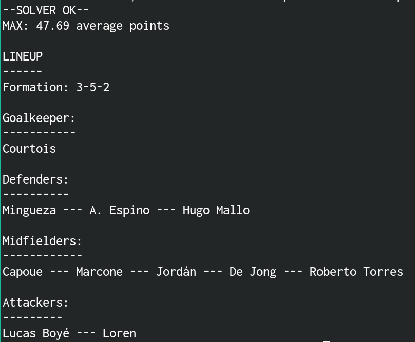
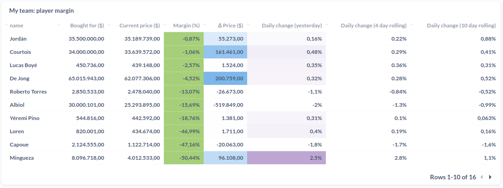
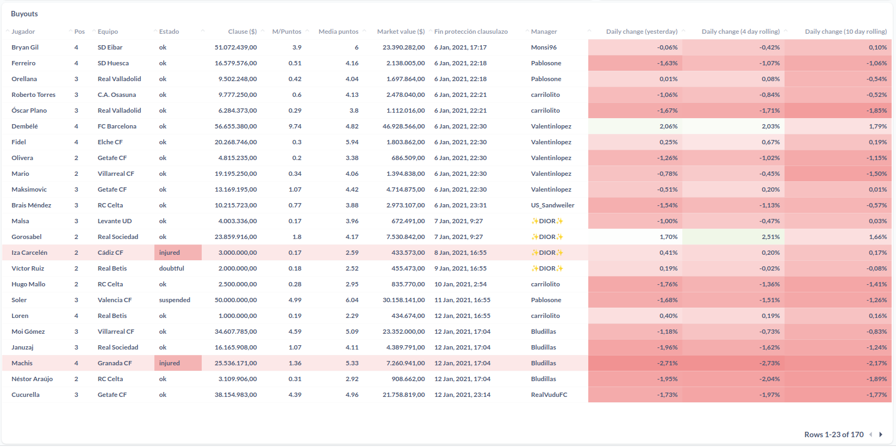
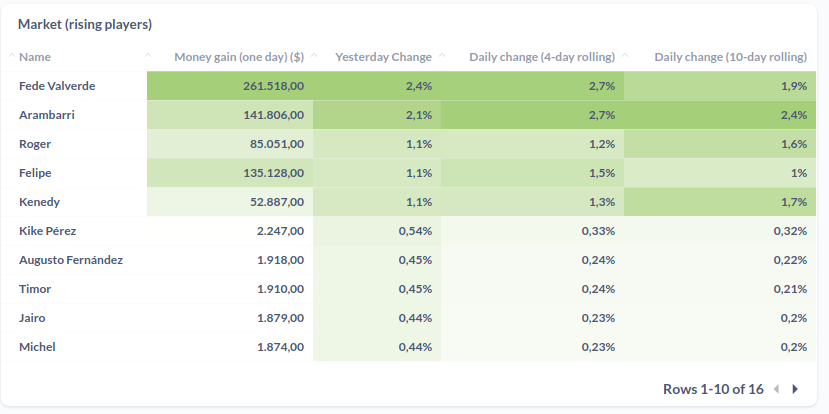

# LaLiga Fantasy Companion Tool


## About

This tool queries LaLiga Fantasy's API for historical data on players,
prices, scored points and other metadata to build dashboards and
insights around the game.

## Config

Required ENV vars are: `DATABASE_URL`, `USERNAME` (email), `PASSWORD`,
`LEAGUE_ID` and `MANAGER_ID`.

A config map (named `config.edn`) under the `resources` folder in the
classpath can also be specified.

Username and password refer to LaLiga Fantasy credentials, and the
database URL is a JDBC type URL.

LaLiga Fantasy access tokens are valid for 24 hours.

## Usage

Run the REPL.

## Usage alternatives

Call another entrypoint, via `:exec-fn`:

    $ clojure -X:healthcheck

Run the project directly, via `:main-opts` (`-m laliga-fantasy.main`):

    $ clojure -M:run-m

Run the project's tests:

    $ clojure -T:build test

Run the project's CI pipeline and build an uberjar:

    $ clojure -T:build ci

Run that uberjar:

    $ java -jar target/laliga-fantasy-tool-0.1.0-SNAPSHOT.jar

If you remove `version` from `build.clj`, the uberjar will become
`target/laliga-fantasy-tool-standalone.jar`.

## Features

### Overview

The main idea is to fetch and analyse metrics of all of LaLiga's
players to determine their value (price vs performance) and their
market trend (buy low, sell high). LaLiga's market dynamics are quite
simple and it is easy to estimate trends and fitting curves for any
given player's market value.

### Lineup picker (using [pyomo](https://github.com/Pyomo/pyomo))

```
clojure -X:picker
```



Using constraint programming and taking into account the current
available players in the squad, the lineup picker will yield the
**most efficient** lineup. The objective function is to maximise the
sum of average points across players, with the following constraints:

- 11 players
- No injured or suspended players
- One goalkeeper
- One of the following formations:
  - 3-4-3
  - 3-5-2
  - 4-3-3
  - 4-4-2
  - 4-5-1
  - 5-3-2
  - 5-4-1

Premium formations such as 5-2-3, 4-6-0, etc are not supported.

Obviously, sometimes players can simply sit one out and rest and there
is no way of knowing in advance, but this lineup picker would always
choose the best players in the long run.

### Profits



### Buyouts

Buyout clauses expiration times are clearly visible, down to the
minute. Hours and minutes are not shown in the UI, but they're present
in the JSON response.



#### Sabotage

A direct product of buyouts and line up analysis.

This shows the number of players **per position** for each
manager. The goal is to find available players (without buyout clause
lock) that would leave out their manager with an invalid line up (and
therefore without the possibility of scoring any points in that
particular fixture).

In any case, the manager will always have a minimum of 24h to find a
substitute (either from the League's market, or by buying out a player
from another manager).


### Market



## Activity


This part is crucial to determine the other players' cash amount and
things like your own profit margins.
